# Architecture Landscape — Foundations (DS-269)

> Enterprise-level view of how the 6 Tier-1 Reference Architectures, the ADR/governance pipeline,
> and the quality-metrics loop fit together as one system landscape. Each box links back to the
> convention doc that actually defines it — this diagram is an index/map, not a substitute for
> reading those docs. Not a Confluence-published convention page (descriptive, not prescriptive
> rules) — kept at repo root alongside `DELIVERABLES.md`.

## Why this exists

The 19 deliverables were built and reviewed one file at a time, which is the right way to *write*
convention docs (per `_templates/convention-template.md`'s Why/Rules/Tooling shape) but the wrong
way to *see* them — nothing showed how a request actually flows through a BFF, into the standard
stack, out through the event backbone, into a workflow engine or a serverless consumer, while the
ADR/Confluence/Claude sync and the metrics loop run underneath the whole thing. This diagram is
that missing picture.

## Landscape diagram

```mermaid
flowchart TB
    subgraph CLIENT["Client Layer"]
        Browser["Browser"]
    end

    subgraph APP["Application Layer — Standard Stack + SPA/BFF RAs"]
        SPA["Angular SPA"]
        BFF["BFF (Spring Boot)<br/>auth aggregation, response shaping"]
        SessionStore["Session Store (Redis)<br/>httpOnly cookie"]
        Gateway["API Gateway<br/>(only when shared cross-cutting need exists)"]
        SvcCheckout["Checkout Service<br/>(Spring Boot)"]
        SvcOrders["Orders Service<br/>(Spring Boot)"]
        SvcInventory["Inventory Service<br/>(Spring Boot)"]
        SvcNotify["Notification Service<br/>(Spring Boot)"]
    end

    subgraph DATA["Data Layer — Multi-Tenant Isolation RA"]
        Provisioning["Tenant Provisioning Service<br/>(control plane)"]
        DBShared["Shared-schema DB<br/>tenant_id + Postgres RLS<br/>(SaaS tier)"]
        DBDedicated["Dedicated schema/DB<br/>per regulated tenant<br/>e.g. Swiss Olympic — CH region"]
    end

    subgraph EVENTBUS["Event Backbone — Event-Driven RA"]
        EventHub["Azure Event Hub<br/>order-events (ADR-0003)"]
        ConsumerA["Idempotent Consumer A<br/>(ADR-0004: at-least-once + dedupe)"]
        ConsumerB["Idempotent Consumer B"]
        DLQ["order-events-dlq<br/>(3 retries, exp. backoff)"]
        SchemaRule["eventVersion envelope<br/>additive-only (ADR-0005)"]
    end

    subgraph ASYNC["Async / Serverless Layer — Serverless RA"]
        FnQueue["Azure Function<br/>(queue-triggered, 5s p99 cold-start budget)"]
        FnHttp["Azure Function<br/>(HTTP-triggered, provisioned concurrency)"]
        FnTimer["Azure Function<br/>(timer-triggered batch job)"]
    end

    subgraph WORKFLOW["Workflow Layer — Workflow Automation RA"]
        Flowable["Flowable engine<br/>(embedded in Spring Boot, default)"]
        TaskInbox["Task Inbox UI<br/>(Angular)"]
        ServiceTask["JavaDelegate service task<br/>(auto-approval threshold logic)"]
    end

    subgraph CONTROL["Control Plane — Crosscutting Data/Control-Plane Separation"]
        CICD["GitHub Actions / Azure DevOps<br/>CI/CD orchestration"]
        Terraform["Terraform / IaC state<br/>(non-Swiss region OK)"]
        Monitoring["Observability stack<br/>(Azure Monitor / Datadog)"]
    end

    subgraph GOV["ADR & Governance Pipeline"]
        Git["Git — adr/*.md<br/>single source of truth"]
        PRReview["PR review<br/>(ADR Governance Model, SA approval)"]
        PublishPy["publish.py<br/>(Path 1)"]
        Confluence["Confluence<br/>(human read surface)"]
        PackagePlugin["package_claude_plugin.py<br/>(Path 2)"]
        ClaudePlugin["Claude plugin skills:<br/>adr-lookup, arc42-template,<br/>reference-architectures"]
        DriftCheck["check_sync_drift.py<br/>(alert if >24h stale)"]
    end

    subgraph SUPPORT["Support & Quality Loop"]
        SupportRequest["Architecture Support Request<br/>(Jira queue, SLA)"]
        SAGroup["SA Group"]
        Guild["Architecture Guild<br/>(escalation, binding decision)"]
        Metrics["Quality Metrics Catalogue<br/>(10 KPIs, interim spreadsheet)"]
        FutureIDP["Future IDP (Port)<br/>— ingests the metric contract only"]
    end

    Browser --> SPA
    SPA -->|"cookie session"| BFF
    BFF <--> SessionStore
    BFF -->|"bearer token exchange"| Gateway
    Gateway --> SvcCheckout
    Gateway --> SvcOrders
    Gateway --> SvcInventory

    SvcCheckout --> DBShared
    SvcOrders --> DBShared
    Provisioning --> DBShared
    Provisioning --> DBDedicated
    Provisioning -.->|"control plane, region-free"| CICD

    SvcCheckout -->|"publish order-events"| EventHub
    EventHub --> SchemaRule
    EventHub --> ConsumerA
    EventHub --> ConsumerB
    ConsumerA -->|"processing fails 3x"| DLQ
    ConsumerB --> SvcNotify
    ConsumerA --> SvcInventory

    EventHub -.->|"queue trigger"| FnQueue
    FnQueue --> DBShared
    SvcOrders -.->|"on-demand call"| FnHttp
    FnTimer --> Metrics

    SvcOrders --> Flowable
    Flowable --> ServiceTask
    Flowable --> TaskInbox
    TaskInbox --> Browser

    CICD --> Terraform
    Terraform --> DBShared
    Terraform --> DBDedicated
    Monitoring --> SvcCheckout
    Monitoring --> EventHub
    Monitoring --> FnQueue
    Monitoring --> Metrics

    Git --> PRReview
    PRReview --> Git
    Git --> PublishPy --> Confluence
    Git --> PackagePlugin --> ClaudePlugin
    PackagePlugin --> DriftCheck
    DriftCheck -.->|"alert #arch-alerts"| SAGroup

    SupportRequest --> SAGroup
    SAGroup -->|"precedent-setting"| Git
    SAGroup -->|"no consensus in 5 business days"| Guild
    Guild --> Git

    Metrics --> FutureIDP
    CICD --> Metrics
    Monitoring --> Metrics
```

## How to read this

- **Solid arrows** are request/data flow at runtime. **Dotted arrows** are control-plane,
  async-trigger, or governance-flow relationships (deploy-time, decision-time, or event-trigger
  rather than a direct synchronous call).
- **Every box is governed by exactly one convention doc** — this diagram doesn't introduce any
  component that isn't already defined somewhere in the repo:

| Subgraph | Governing doc(s) |
|---|---|
| Application Layer | [`standard-stack.md`](reference-architectures/standard-stack.md), [`frontend-spa-bff.md`](reference-architectures/frontend-spa-bff.md) |
| Data Layer | [`multi-tenant-data-isolation.md`](reference-architectures/multi-tenant-data-isolation.md) |
| Event Backbone | [`event-driven.md`](reference-architectures/event-driven.md), [ADR-0003/0004/0005](adr/) |
| Async / Serverless Layer | [`serverless-workloads.md`](reference-architectures/serverless-workloads.md) |
| Workflow Layer | [`workflow-automation.md`](reference-architectures/workflow-automation.md) |
| Control Plane | [`data-control-plane-separation.md`](crosscutting/data-control-plane-separation.md) |
| ADR & Governance Pipeline | [`adr-template-lifecycle.md`](adr/adr-template-lifecycle.md), [`adr-governance-model.md`](adr/adr-governance-model.md) |
| Support & Quality Loop | [`support-request-process.md`](architecture-support/support-request-process.md), [`metrics-catalogue.md`](quality-metrics/metrics-catalogue.md) |

## What this diagram is not

- Not a diagram of any *specific* mesoneer product — it's the composite of all 6 Tier-1 patterns
  stitched together as if one hypothetical system used every one of them, so the relationships
  between RAs are visible. A real project picks the subset of RAs it actually needs (see the
  [arc42/C4 Adoption Guide](documentation-template/adoption-guide.md)'s mandatory-vs-optional
  rule) — nobody is expected to run all six at once.
- Not rendered from live infrastructure — it's a design-time map, same as the RA docs it indexes.
  If a RA doc changes shape, this diagram needs a matching edit (no automated sync between them,
  same known gap noted in `DELIVERABLES.md` for doc-structure CI checks).
